
# tarea3-peps
Para la entrega de la tarea 3 de PePS.

Pasos seguidos:
1. 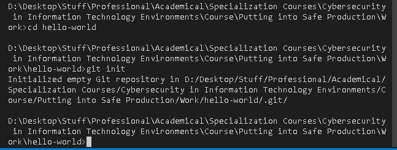 

Iniciamos el proyecto en local

2. 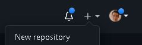 

Creamos un repositorio en Github.

3. 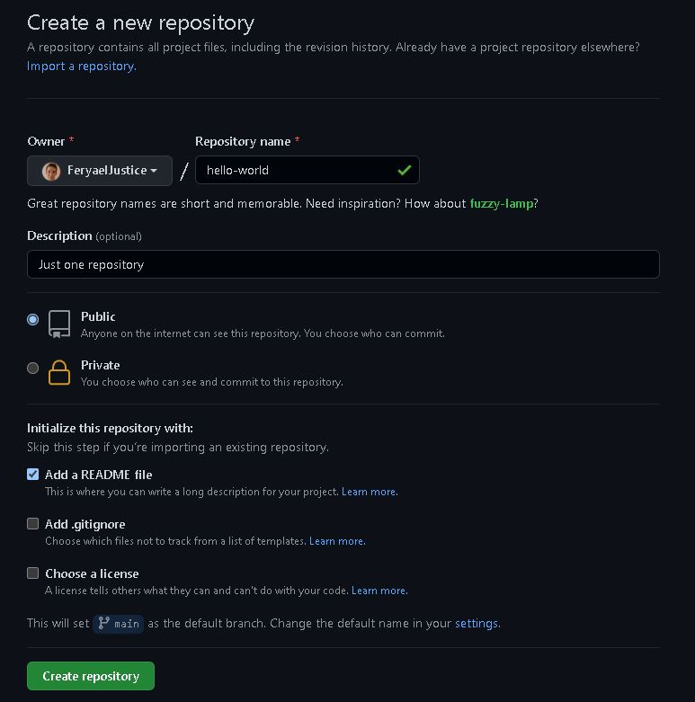 

Creamos el repositorio llenando los datos y creando el Readme.

4. 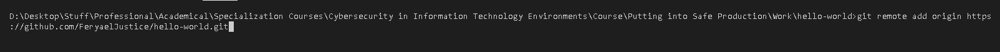 

Añadimos el repositorio remoto de github a nuestro repo local.

5. 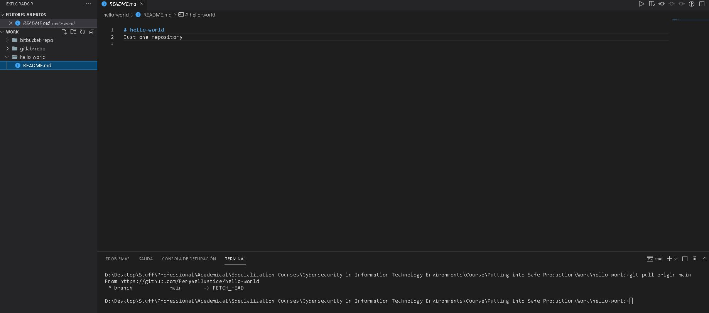 

Hacemos git pull del repo de github.

6. 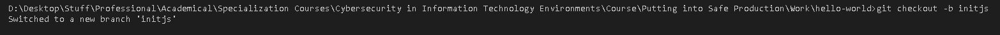 

Creamos una nueva rama en local y nos pasamos a ella.

7. 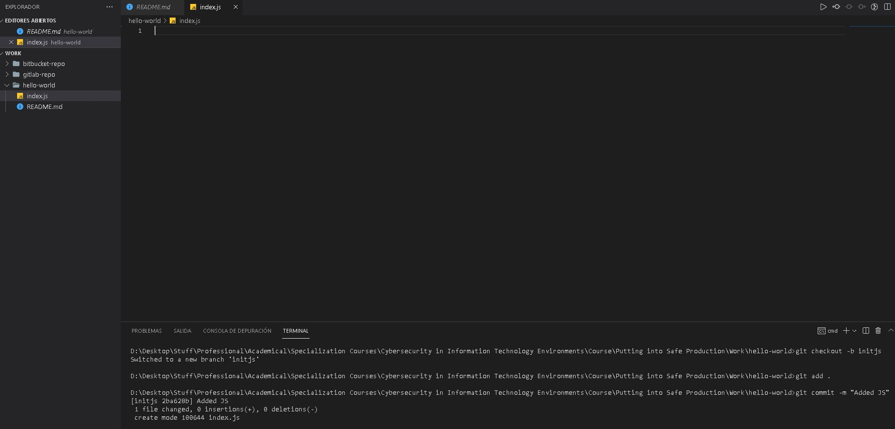 

Hacemos un git commit en la nueva rama.

8. 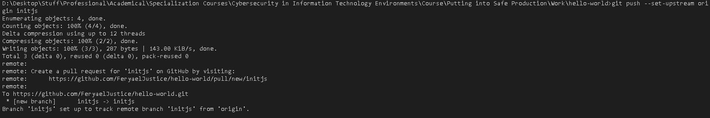 

Hacemos el push de nuestro repo a el repo remoto.

9. 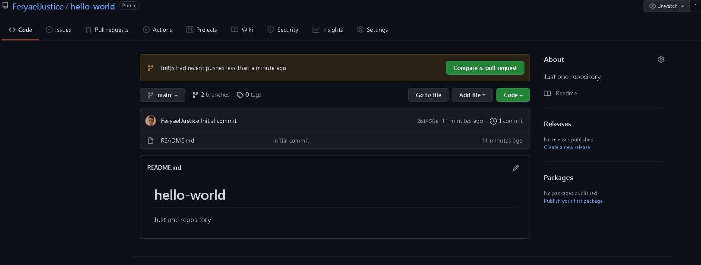 

Vemos que tenemos nuevos cambios en github y creamos nuestro pull request para que el admin apruebe los cambios y lo unamos a la rama main.

10. 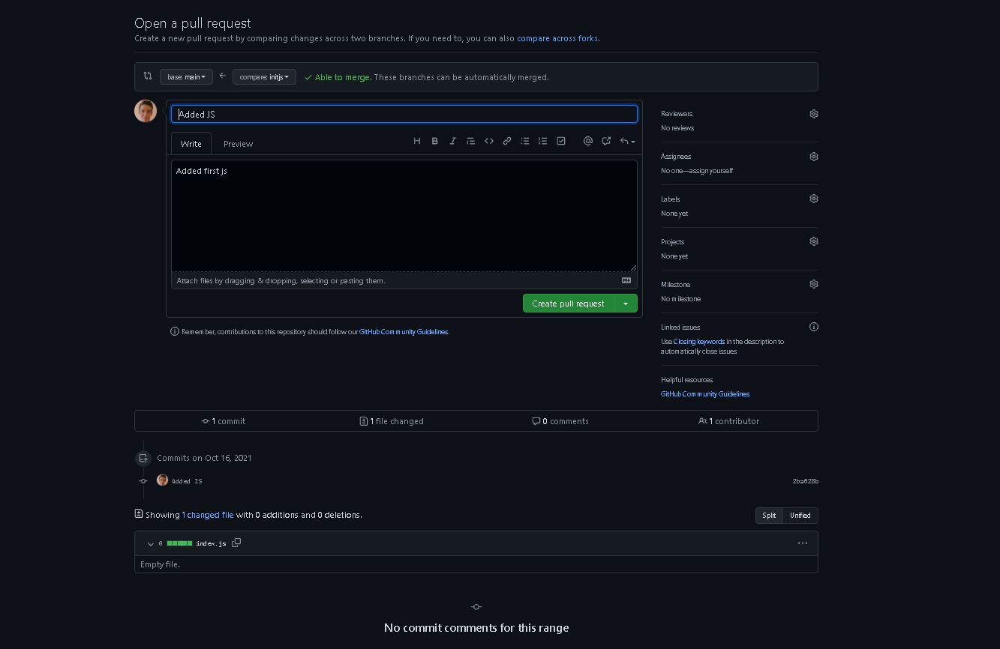 

Creamos el pull request.

11.  

Aceptamos el pull request.

12. 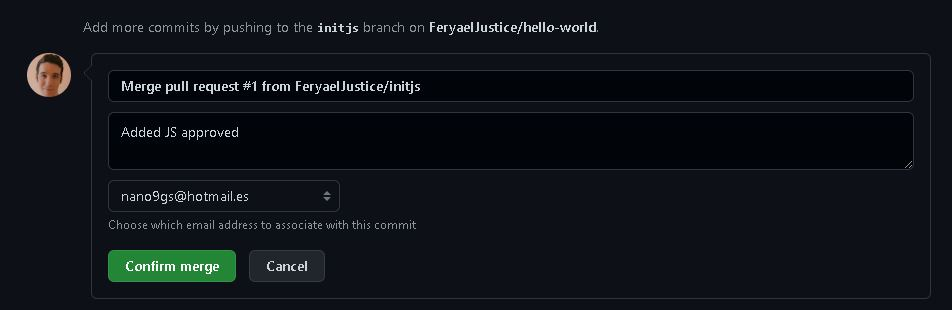 

Hacemos el merge a la rama principal.

13. 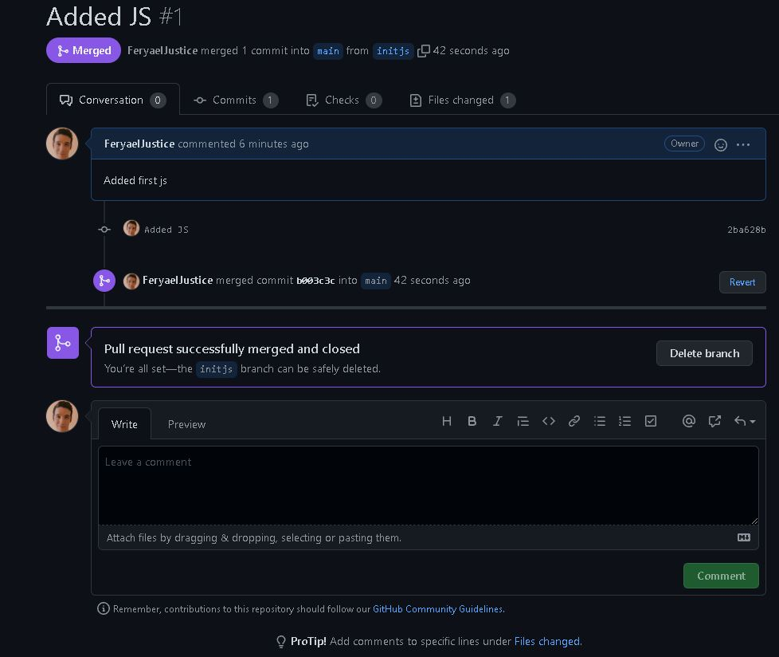 

Hemos mergeado.