
# tarea3-peps
Para la entrega de la tarea 3 de PePS.

Pasos seguidos:
1. 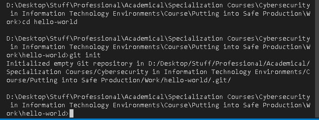 

Iniciamos el proyecto en local

2.  

Creamos un repositorio en GitHub.

3. 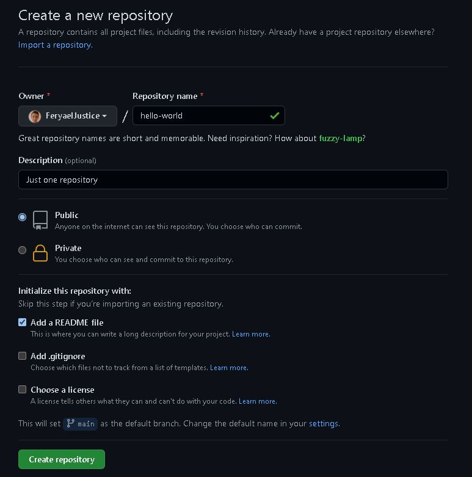 

Creamos el repositorio, completamos los datos y creamos el README.

4. 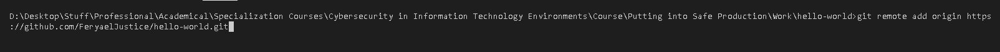 

Añadimos el repositorio remoto de GitHub a nuestro repositorio local.

5. 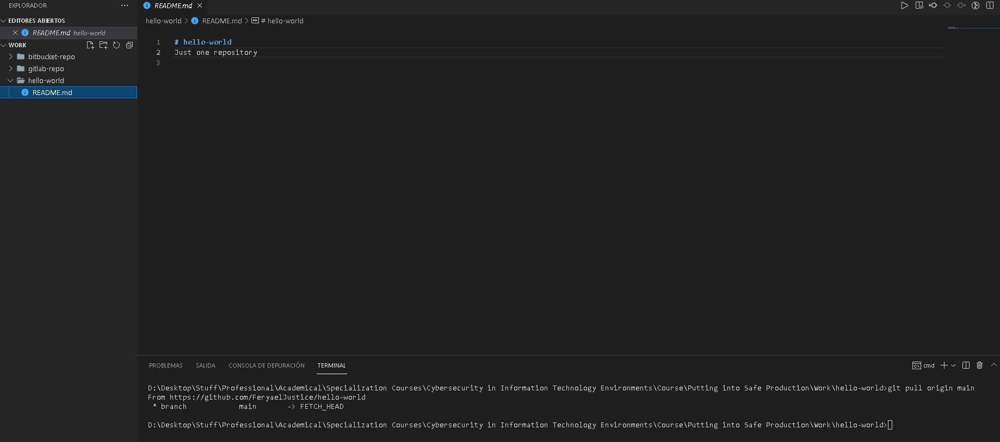 

Hacemos git pull del repositorio de GitHub.

6. 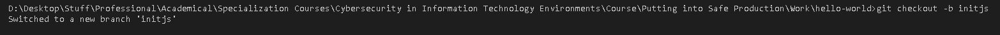 

Creamos una nueva rama en local y cambiamos a ella.

7. 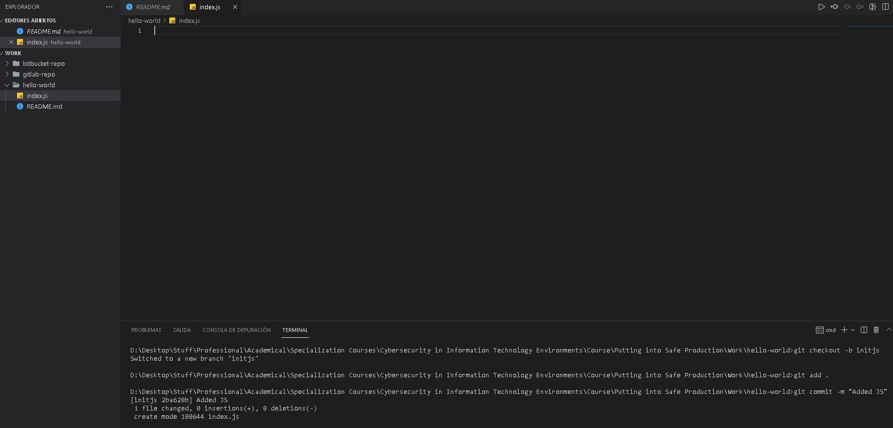 

Hacemos un git commit en la nueva rama.

8. 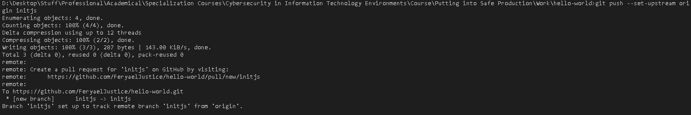 

Hacemos push de nuestro repositorio al repositorio remoto.

9. 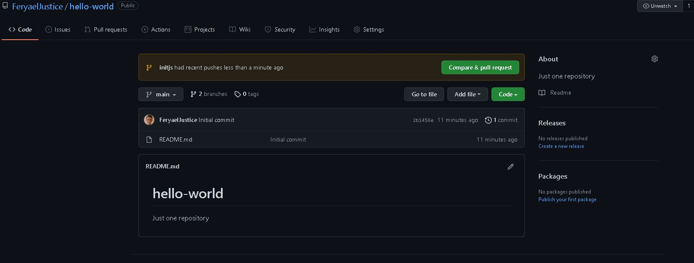 

Comprobamos que hay nuevos cambios en GitHub y creamos una pull request para que la persona administradora los apruebe y podamos unirlos a la rama main.

10. 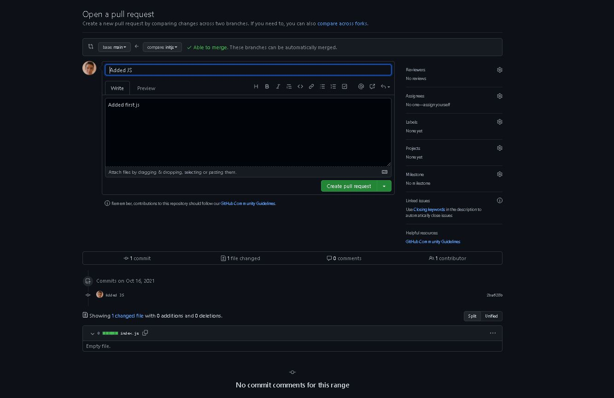 

Creamos el pull request.

11. 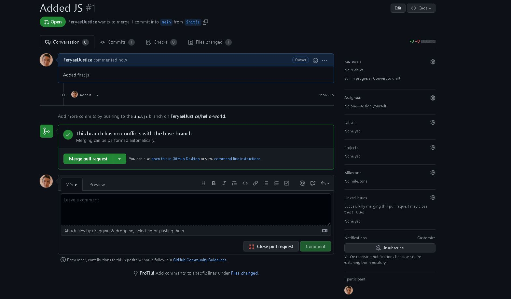 

Aceptamos la pull request.

12. 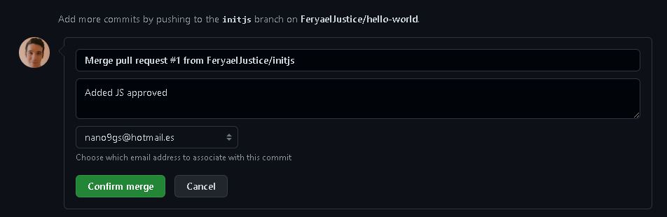 

Fusionamos los cambios con la rama principal.

13. 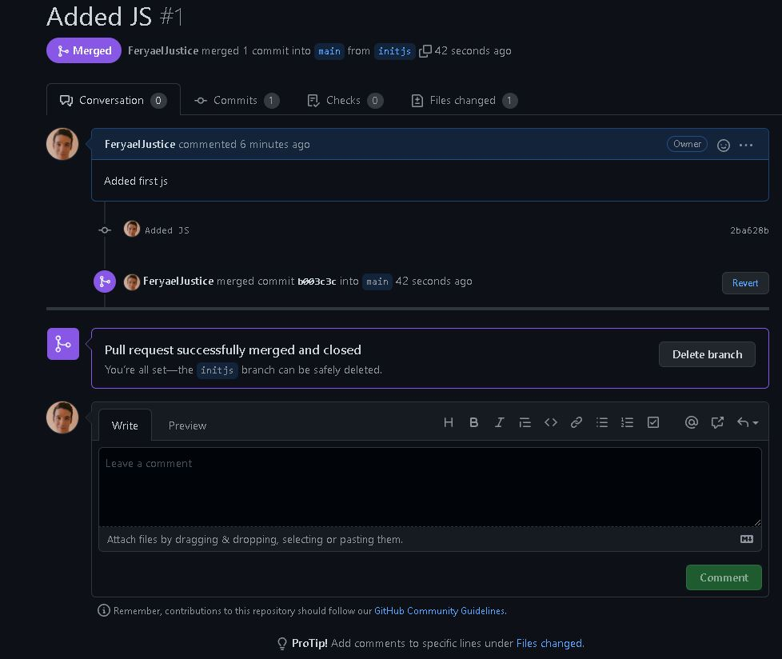 

Hemos completado la fusión.